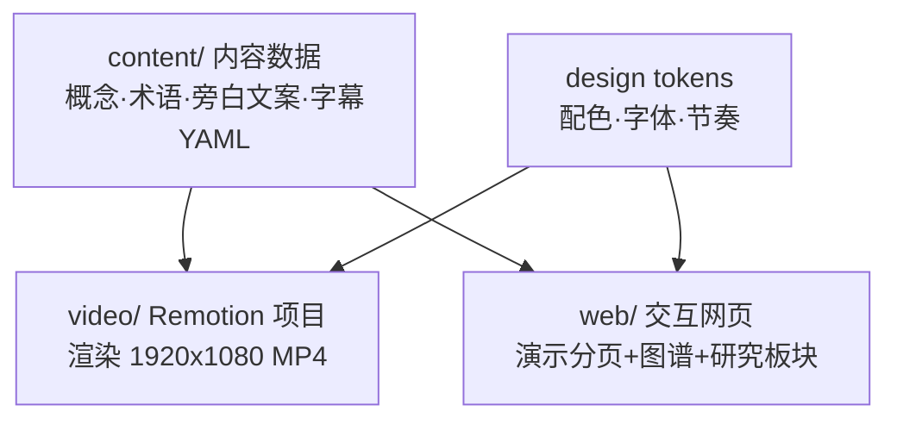
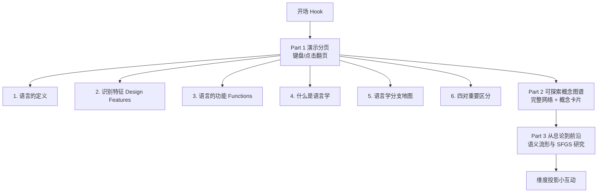

# PRD：语言学总论 · 交互式知识图谱展示

## 背景与目标

「普通语言学知识图谱建设」课程作业，第 1 组（陈镜宇、张朝阳）负责「语言学总论」章节。
参照张立飞老师《普通语言学核心概念图谱 1.0》的要求：以核心概念为节点，以分类、组成、关联、对立、理论解释、研究方法为关系，产出可视化的知识图谱成果。

本产物是一张会讲故事的知识图谱：前半部分演示式分页讲解知识点（课堂投影用），后半部分放出完整可探索的概念网络，并附「从总论到前沿」研究板块。参考 Vibe 知识分享的审美：杂志感、有动效、可互动。

- 语言：英文讲解为主（English-primary），配合中文小字幕做关键解释；术语中英对照
- 双产物（v2 修订）：
  1. 可交互网页：Vibe 知识大赏审美的演示 + 探索站，课后同学自行打开
  2. MP4 视频：从同一套内容数据与设计语言渲染（Remotion 路线），课堂播放
- 使用场景：课堂放视频；网页作为知识图谱 1.0「总论」章节的可持续迭代成果

## 双产物架构（v2）

文件级计划：
- content/graph.yaml：图谱节点与关系（概念、定义、例子、关系类型）
- content/script.yaml：视频旁白与字幕时间轴文案（英文正文 + 中文小字幕）
- video/：Remotion 项目（package.json、remotion.config、compositions/、components/），读取 content/ 渲染 MP4；Node 20 已就绪，Remotion 自带渲染用 ffmpeg
- web/：纯静态交互网页（index.html + css/ + js/ + assets/），图谱数据由 content/graph.yaml 生成或直接复用其 JSON 导出，零 CDN，双击即用
- 网页与视频共享配色、字体、图标等设计令牌，保证两个产物观感一致

## 站点结构

## Part 1：演示分页内容大纲

呈现方式：每页英文为正文/标题，中文以小字幕或术语角标形式辅助。以下大纲中的中文为内容基准，英文术语为必须出现的对照。

### 0. 开场
钩子：同一句话，不同的人听出不同的意思。语言比我们以为的复杂得多，这一章先把「语言」和「语言学」这两件事讲清楚。

### 1. 语言的定义
Language is a system of arbitrary vocal symbols used for human communication.
拆四个关键词做成卡片：
- system 系统性：语言是按规则组织的系统，不是杂乱符号
- arbitrary 任意性：词和所指事物之间没有必然联系（「狗」为什么叫 gǒu？）
- vocal 声音媒介：口语是第一性的，文字是派生
- human 人类独有：动物交际系统不具备全部识别特征

### 2. 识别特征 Design Features
- Arbitrariness 任意性：能指与所指无自然联系（索绪尔）
- Duality 二重性：无意义的语音层 × 有意义的符号层，双层结构效率极高
- Creativity 创造性：有限手段，无限使用（递归造句）
- Displacement 移位性：可以谈论不在此时此地的事物（过去、未来、虚构）
- Cultural Transmission 文化传递：语言靠教与学传递，不是靠基因

### 3. 语言的功能 Functions
- Informative 信息功能：陈述事实（语言最主要的功能）
- Interpersonal 人际功能：维持社会关系与身份
- Performative 施为功能：说话即做事（「我宣布…」「我道歉」）
- Emotive 感情功能：表达态度与情绪
- Phatic 寒暄功能：「吃了吗？」不为信息，为接通关系
- Recreational 娱乐功能：诗歌、段子、文字游戏
- Metalingual 元语言功能：用语言谈论语言（语言学本身就在用它）

### 4. 什么是语言学
Linguistics is the scientific study of language.
「科学」二字的三条准则：Exhaustiveness 穷尽性、Consistency 一致性、Economy 经济性。
研究过程：观察语料 → 概括假设 → 验证修正。

### 5. 语言学分支地图
核心分支（本课程后续章节，各由对应小组展开）：
- Phonetics 语音学：语音的物理与生理
- Phonology 音系学：语音在系统中的组织规律（第 2 组）
- Morphology 形态学：词的内部结构（第 3 组）
- Syntax 句法学：句子结构（第 4 组）
- Semantics 语义学：意义
- Pragmatics 语用学：语境中的意义
宏观/交叉分支：Sociolinguistics 社会语言学、Psycholinguistics 心理语言学、Applied Linguistics 应用语言学、Computational Linguistics 计算语言学（← 通往 Part 3 的桥）。

### 6. 四对重要区分
- Prescriptive 规定式 vs Descriptive 描写式：语言学描写事实，不规定对错
- Synchronic 共时 vs Diachronic 历时：某一时刻的切片 vs 历史演变
- Langue 语言 vs Parole 言语（索绪尔）：社会共享的系统 vs 个人的实际使用
- Competence 语言能力 vs Performance 语言运用（乔姆斯基）：内在知识 vs 实际表现

## Part 2：可探索概念图谱

- 节点：总论全部核心概念（约 25–35 个：语言、识别特征 5 个、功能 7 个、语言学、分支 10 个、四对区分 8 个，可加索绪尔/乔姆斯基人物节点）
- 边：标注关系类型（分类 / 组成 / 对立 / 理论解释 / 指向章节），用颜色或线型区分；「对立」关系（langue↔parole 等）视觉上要一眼可辨
- 交互：节点可拖拽、点击弹出概念卡片（中文定义 + 英文术语 + 例子 + 相关概念可跳转）、支持搜索与按模块筛选、滚轮缩放
- 布局：力导向或手工分区布局，首屏即可看清整体结构

## Part 3：从总论到前沿（研究板块）

署名：Cran May，杭州电子科技大学 JWorld NLPark。

- 语义流形假说：意义不是离散符号，而是高维连续潜空间中的流形；生成文本应建模为能量地貌上的最优路径搜索，而非逐词概率采样
- SFGS 架构一页图解（Semantic Flow-Driven Generative System）：
  - 流规划器 Flow Planner：用随机微分方程 dFt = μθ dt + σφ dWt 在连续潜空间铺出「语义河床」
  - 能量引导生成器：注意力分数修正 Score = QKᵀ/√dk − γ‖Q − Ft‖²，偏离规划就衰减
  - 能量判别器 Energy Meter：给流畅且连贯的文本低能量
  - 推理：朗之万动力学沿能量梯度最速下降，从直觉式生成（System 1）走向规划式生成（System 2）
- 维度投影小互动：一个 3D 流形/点云投影到 2D 的实时演示，用户可切换视角与维度，直观看到「低维空间接收高维意义时的信息损失」与「正交时无有效投影」，呼应「80 维意义空间投影到 60 维会损失本征信息」的猜想
- 收束一句：总论里的每个经典概念，都是通向未至之境的路标

## 设计与技术约束

- 审美：Vibe 知识分享风，杂志感排版 + 克制而有记忆点的动效（滚动/翻页触发淡入、连线生长、图谱入场动画）
- 配色：一套主配色贯穿三部分，暖调纸感或深空感二选一，由 designer 定稿并在 PRD 回复中注明
- 图标：本地 SVG（Tabler 风格），禁止 emoji 图标，禁止色块左侧强调竖线，禁止依赖 CDN
- 文件组织：index.html + css/ + js/ 拆分，图谱数据独立成 data 文件，函数保留业务注释
- 分页导航：左右方向键、空格、点击均可翻页，有进度指示；进入 Part 2 后退出演示模式
- 图表/公式：数学公式可手写排版或用本地渲染，不得引用外部 CDN

## 调研结论：Vibe 知识大赏风格要点（2026-10-07 陈知远调研 + 本地样片抽帧验证）

视觉与叙事：
- 排版驱动：超大字号关键词居中，一屏一个信息点，关键词用高亮色（荧光黄/亮蓝/品红撞深色底）
- 双语字对：中文主标题 + 英文衬线斜体副标题；章节标签英文大写 + 中文小字（样片实证）
- 动效：逐句弹入、弹簧缓动（spring）、缩放强调、元素互相触发（信号到达时边框亮起等联动），单镜头 2–4 秒
- 字幕：逐词 karaoke 高亮；AI/真人旁白 + 低音量 lo-fi/电子 BGM
- 信息密度：高概念低密度，类比先行、术语后置
- 氛围图只用于引入与收束；原理讲解至少占一半篇幅
- 结尾必须回答「这个概念有什么用、与我们今天有什么关系」，先讲改变了什么观察方法，再给具体场景，区分原始定义与现代延伸

工作流（视频部分遵守）：样片先行，确认字体/配色/排版/动作语言后再完成全片；逐场景实现脚本；导出前检查文字、遮挡、黑帧、音画同步；保留可编辑工程与脚本。

## 视频规格（v2）

- 分辨率 1920×1080，时长建议 3–5 分钟（课堂播放场景），英文旁白文案 + 中文小字幕
- 风格对齐 Vibe 知识大赏：文字与图表随讲解节奏展开，节点、连线、画面持续流动变化
- 内容覆盖 Part 1 全部六个知识页 + Part 3 研究板块（图谱作为视频中的动态画面出现）
- 导出 MP4；渲染前文案、时长、字幕定稿，改动走 content/script.yaml

## 验收标准

1. 网页：双击 index.html 离线可用，无外部请求
2. 网页 Part 1 六个内容页 + 开场页翻页流畅，英文讲解 + 中文字幕/术语对照无乱码
3. 网页 Part 2 图谱节点 ≥ 25，可拖可点，概念卡片内容完整，对立关系视觉可辨
4. 网页 Part 3 SFGS 图解与投影小互动可运行
5. 视频：MP4 成功渲染导出，画面节奏与字幕同步，风格与网页一致，内容覆盖六个知识页与研究板块
6. 1920×1080 投影场景下两个产物文字均清晰可读

## 定稿设计令牌（2026-10-07 周念定稿，网页/视频双产物共用，视频渲染请复用以下值）

方向：**深空感（Deep-space editorial）**——对齐样片 f6–f8 的深黑底 + 暖纸白衬线大字 + 暖金高亮 + 细线图解。

### 配色（CSS 变量，web/css/style.css :root）
| 令牌 | 值 | 用途 |
| --- | --- | --- |
| --bg | #0B0B10 | 深空黑主底 |
| --bg-soft | #12121A | 卡片/面板次底 |
| --bg-raise | #1A1A24 | 浮起层 |
| --ink | #F2EDE3 | 暖纸白主文字 |
| --ink-dim | rgba(242,237,227,.58) | 次级文字 |
| --ink-faint | rgba(242,237,227,.32) | 注释/中文小字幕 |
| --line | rgba(242,237,227,.14) | 细线/边框 |
| --accent | #F0C96B | 暖金：关键词高亮、主 CTA、进度 |
| --accent-soft | rgba(240,201,107,.12) | 暖金浅底（悬停/选中态） |
| --cyan | #7FD8E8 | 冷青：理论解释关系、流形/河床 |
| --opp | #FF5C7A | 品红：对立关系（双线+流动虚线）、VS 标记 |
| --violet | #B79CFF | 紫：指向章节关系、朗之万回路 |
| --green | #8FD9A8 | 绿：组成关系 |

图谱节点模块色：core=#F0C96B / features=#8FD9A8 / functions=#E8A15C / branches=#7FD8E8 / distinctions=#FF5C7A / people=#B79CFF

### 字体（全系统字体栈，零 CDN）
- 英文展示大字：Georgia, "Times New Roman", serif（衬线）
- 英文 UI/标签："Segoe UI", "Helvetica Neue", Arial, sans-serif（章节标签大写 + .28em 字距）
- 中文小字幕："STSong", "SimSun", serif（宋体感，小字号 + 宽字距）
- 中文 UI："Microsoft YaHei", "PingFang SC", sans-serif
- 等宽（编号/计数）："Cascadia Code", Consolas, monospace

### 节奏与动效
- 弹簧缓动 --spring: cubic-bezier(.34, 1.56, .64, 1)；缓出 --ease-out: cubic-bezier(.16, 1, .3, 1)
- 翻页入场：元素按 --i × 110ms 级联延迟，spring-in（上浮 34px + 缩放 .97 → 1）
- 圆角 --radius: 14px；单镜头节奏对应网页单页一屏
- 图谱氛围：节点 2.2px 正弦待机浮动；对立边 18px/s 流动虚线偏移

### 双语字对规范
英文为正文/标题主力（衬线大字或大写标签），中文以宋体小字紧随其后（角标/字幕位），术语中英对照不混排斜体。

### v2 字号阶梯（2026-10-07 迭代）
- 卡片/列表正文统一 14–15px；术语名 22–26px；中文小字幕 13px 起步（原 12）
- 投影页正文 clamp 上限 19–21px
- research.js SVG 图解：小字号批量上调（10.5→11.5、11→12 等 8 处）+ 侧边批注 16px、box 标题 15px（字幕 13px）

### v2 图谱视觉规范（2026-10-07 迭代）
- 节点分型：core 双环 + 径向光晕；distinctions 品红虚线外环；people 菱形；其余模块色细环 + tint 填充；选中态暖金外环 + 呼吸光晕
- 对立边：双线流动虚线 + 中点「VS」胶囊徽章；指向章节注记带深色背板 + 紫边
- 标签 LOD 三级：远景只留 core/焦点，中景全英文，近景补中文宋体；字号随缩放 11.5–16px 自适应，带深色圆角背板
- 布局：手工分区坐标 + 轻力导向（回家弹簧 0.012 + 近距斥力 + 0.82 阻尼），拖拽松手回弹
- 动效：滚入视口按模块级联 spring 弹入，边逐条生长；搜索/跳转落点涟漪；hover 高亮关联、其余压暗至 0.16–0.32
- 画布右下角缩放 HUD（−/＋/复位 + 百分比读数，本地 SVG 图标）
